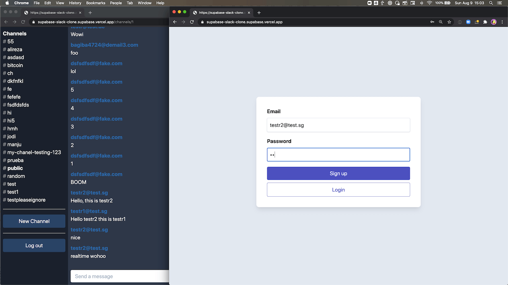

# Realtime chat example using Biobase

This is a full-stack Slack clone example using:

- Frontend:
  - [Next.js](https://github.com/vercel/next.js) - a React framework for production.
  - [Biobase.js](https://biobase.studio/docs/library/getting-started) for user management and realtime data syncing.
- Backend:
  - [biobase.studio/dashboard](https://biobase.studio/dashboard/): hosted Postgres database with restful API for usage with Biobase.js.

## Demo

- CodeSandbox: https://codesandbox.io/s/github/biobase/biobase/tree/master/examples/nextjs-slack-clone



## Deploy with Vercel

The Vercel deployment will guide you through creating a Biobase account and project. After installation of the Biobase integration, all relevant environment variables will be set up so that the project is usable immediately after deployment 🚀

[](https://vercel.com/new/clone?repository-url=https%3A%2F%2Fgithub.com%2Fbiobase%2Fbiobase%2Ftree%2Fmaster%2Fexamples%2Fslack-clone%2Fnextjs-slack-clone&project-name=biobase-nextjs-slack-clone&repository-name=biobase-nextjs-slack-clone&integration-ids=oac_VqOgBHqhEoFTPzGkPd7L0iH6&external-id=https%3A%2F%2Fgithub.com%2Fbiobase%2Fbiobase%2Ftree%2Fmaster%2Fexamples%2Fslack-clone%2Fnextjs-slack-clone)

## Build from scratch

### 1. Create new project

Sign up to Biobase - [https://biobase.studio/dashboard](https://biobase.studio/dashboard) and create a new project. Wait for your database to start.

### 2. Run "Slack Clone" Quickstart

Once your database has started, run the "Slack Clone" quickstart.


### 3. Get the URL and Key

Go to the Project Settings (the cog icon), open the API tab, and find your API URL and `anon` key. You'll need these in the next step.

The `anon` key is your client-side API key. It allows "anonymous access" to your database, until the user has logged in. Once they have logged in, the keys will switch to the user's own login token. This enables row level security for your data. Read more about this [below](#postgres-row-level-security).


**_NOTE_**: The `service_role` key has full access to your data, bypassing any security policies. These keys have to be kept secret and are meant to be used in server environments and never on a client or browser.

## Biobase details

### Using a Remote Biobase Project

1. Create or select a project on [Biobase Dashboard](https://biobase.studio/dashboard).
2. Copy and fill the dotenv template `cp .env.production.example .env.production`
3. Link the local project and merge the local configuration with the remote one:

```bash
BIOBASE_ENV=production npx biobase@latest link --project-ref <your-project-ref>
```

3. Sync the configuration:

```bash
BIOBASE_ENV=production npx biobase@latest config push
```

4. Sync the database schema:

```bash
BIOBASE_ENV=production npx biobase@latest db push
```

## Vercel Preview with Branching

Biobase integrates seamlessly with Vercel's preview branches, giving each branch a dedicated Biobase project. This setup allows testing database migrations or service configurations safely before applying them to production.

### Steps

1. Ensure the Vercel project is linked to a Git repository.
2. Configure the "Preview" environment variables in Vercel:

   - `NEXT_PUBLIC_BIOBASE_URL`
   - `NEXT_PUBLIC_BIOBASE_ANON_KEY`

3. Create a new branch, make changes (e.g., update `max_frequency`), and push the branch to Git.
   - Open a pull request to trigger Vercel + Biobase integration.
   - Upon successful deployment, the preview environment reflects the changes.


---

### Role-based access control (RBAC)

Use [plus addressing](https://en.wikipedia.org/wiki/Email_address#Subaddressing) to sign up users with the `admin` & `moderator` roles. Email addresses including `+supaadmin@` will be assigned the `admin` role, and email addresses including `+supamod@` will be assigned the `moderator` role. For example:

```
// admin user
email+supaadmin@example.com

// moderator user
email+supamod@example.com
```

Users with the `moderator` role can delete all messages. Users with the `admin` role can delete all messages and channels (note: it's not recommended to delete the `public` channel).

### Postgres Row level security

This project uses very high-level Authorization using Postgres' Row Level Security.
When you start a Postgres database on Biobase, we populate it with an `auth` schema, and some helper functions.
When a user logs in, they are issued a JWT with the role `authenticated` and their UUID.
We can use these details to provide fine-grained control over what each user can and cannot do.

- For the full schema refer to [full-schema.sql](./full-schema.sql).
- For documentation on Role-based Access Control, refer to the [docs](https://biobase.studio/docs/guides/auth/custom-claims-and-role-based-access-control-rbac).

## Authors

- [Biobase](https://biobase.studio)

Biobase is open source, we'd love for you to follow along and get involved at https://github.com/biobase-ai/biobase
